# Machine Learning Development Process

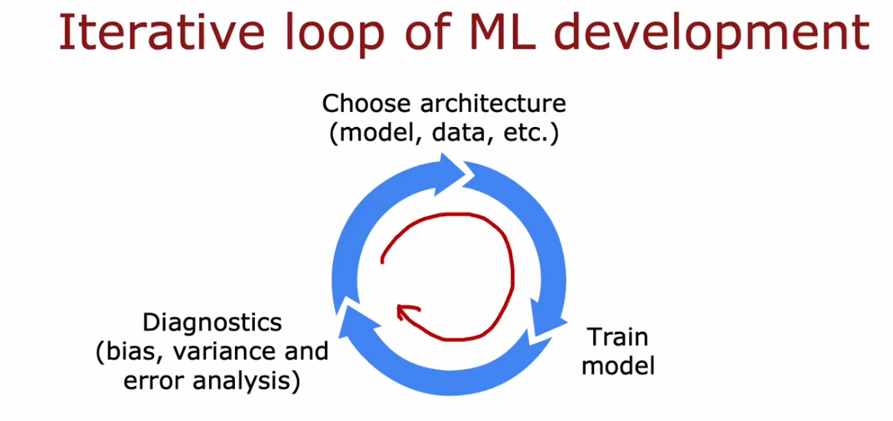
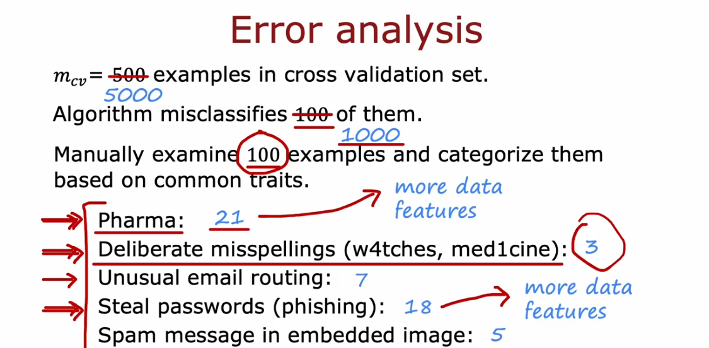
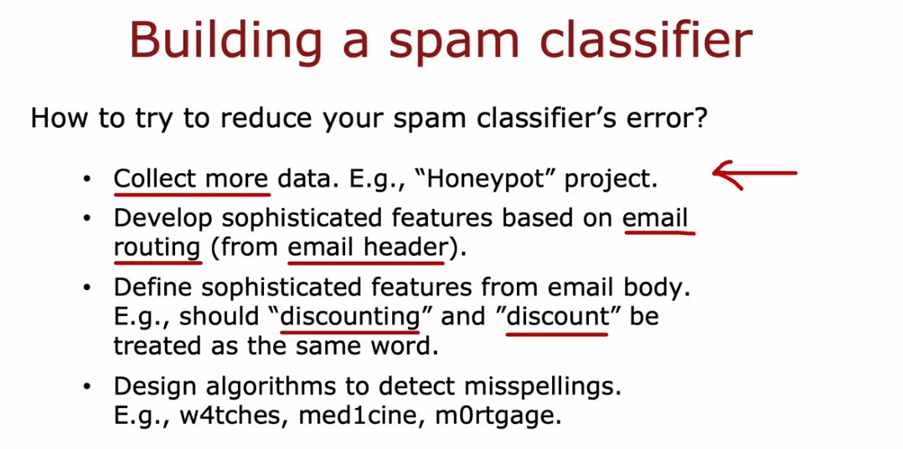

## Adding data
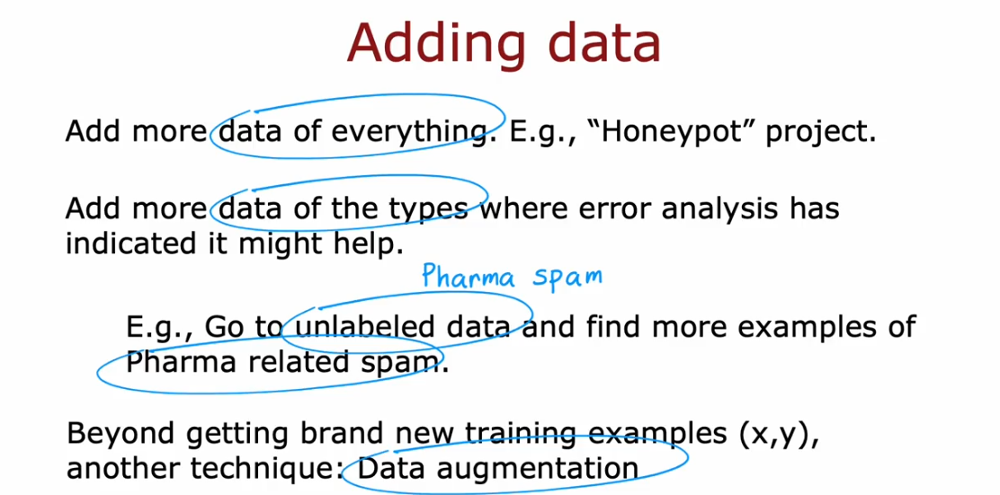
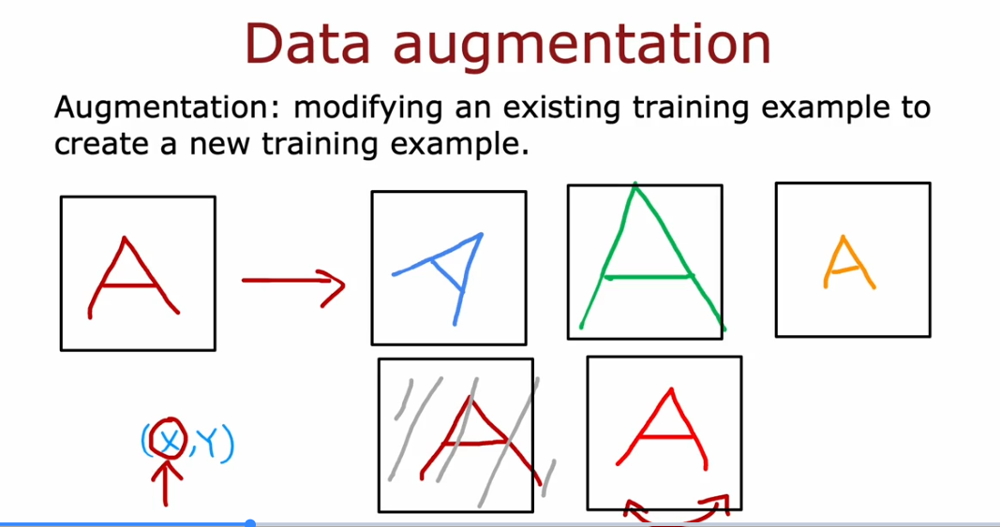
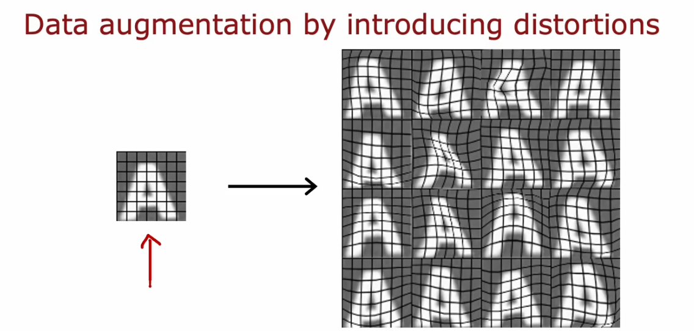
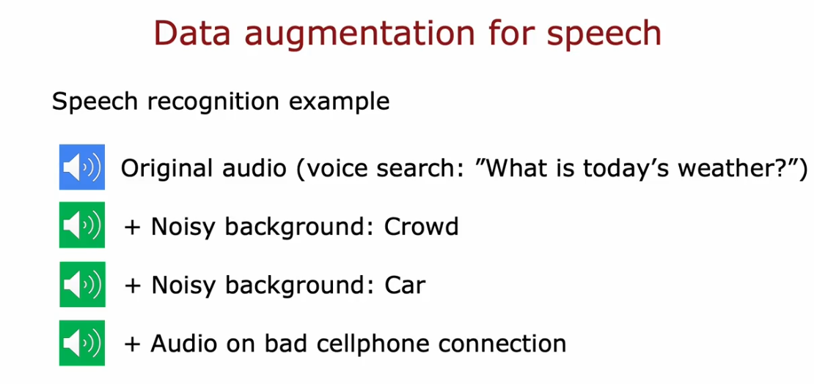
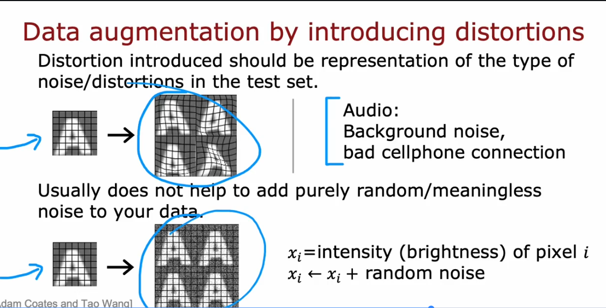

## Data Synthesis
- Using Artificial data input to create new training data

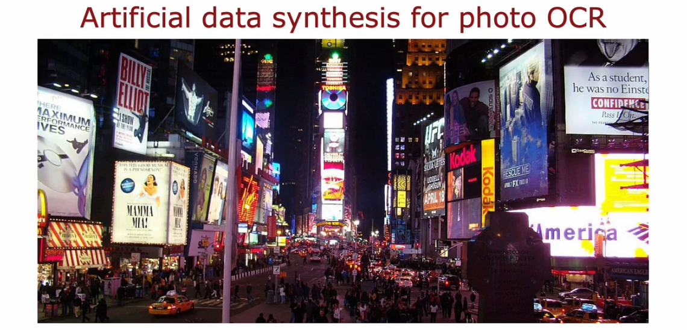
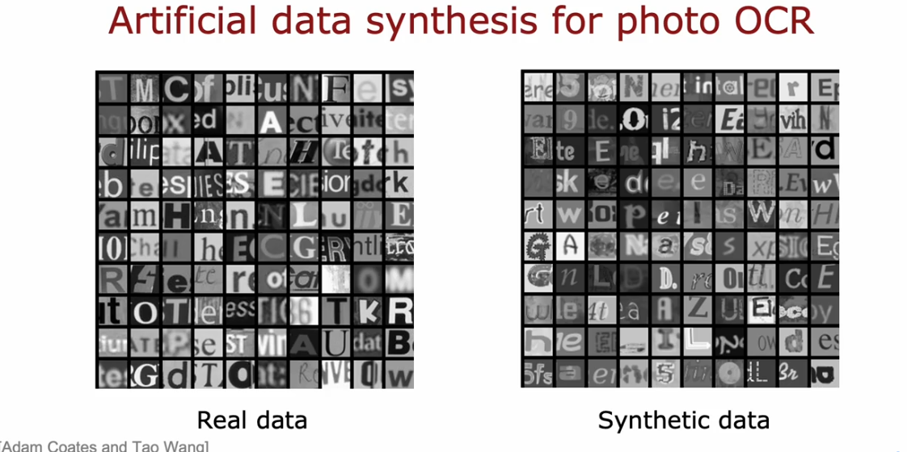
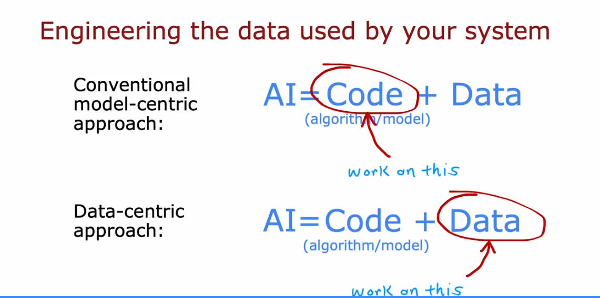

## Transfer Learning

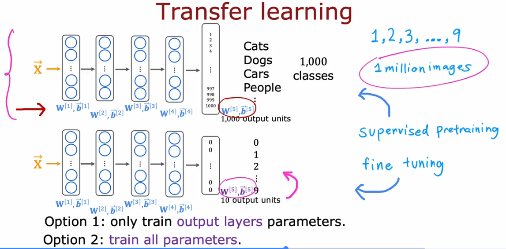
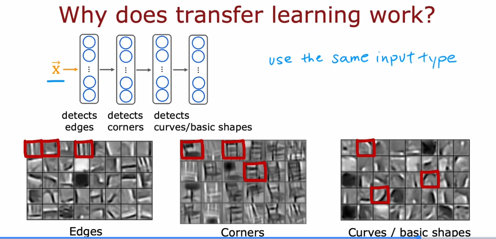
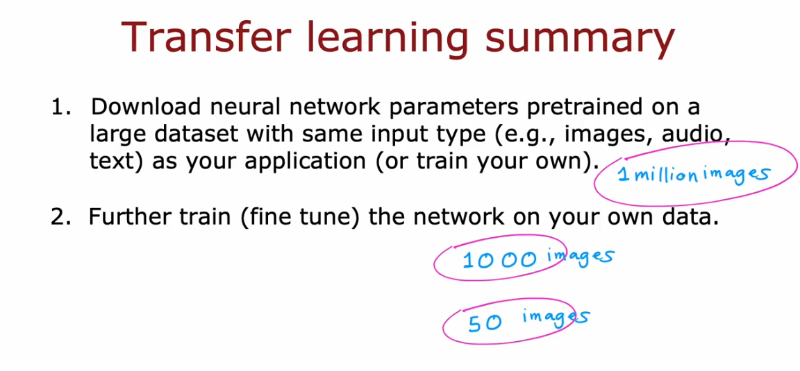

## ML Life cycle

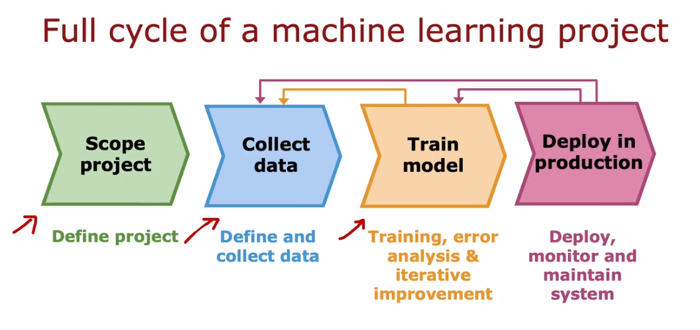
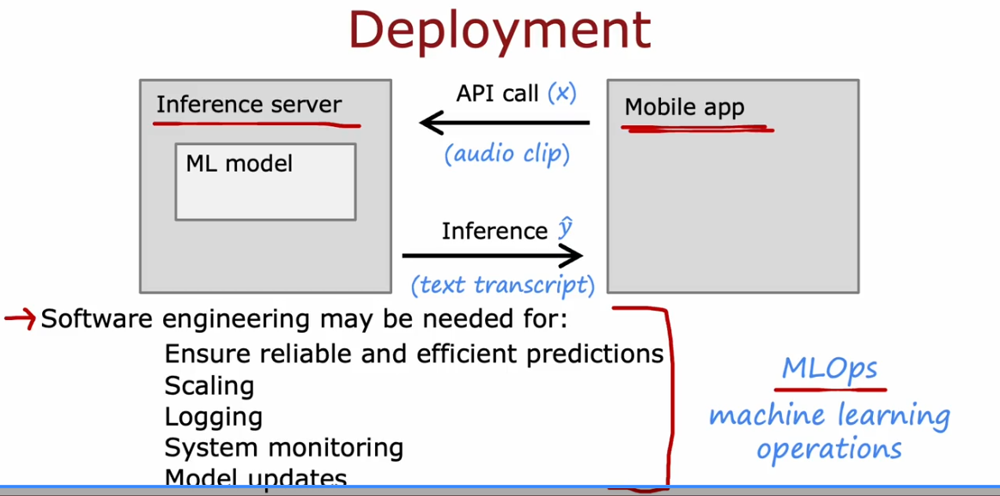

## Precision and Recall

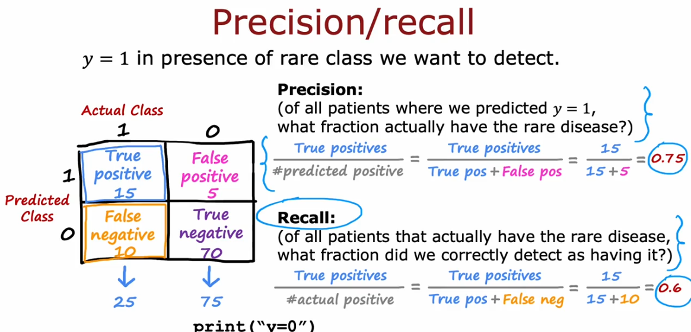
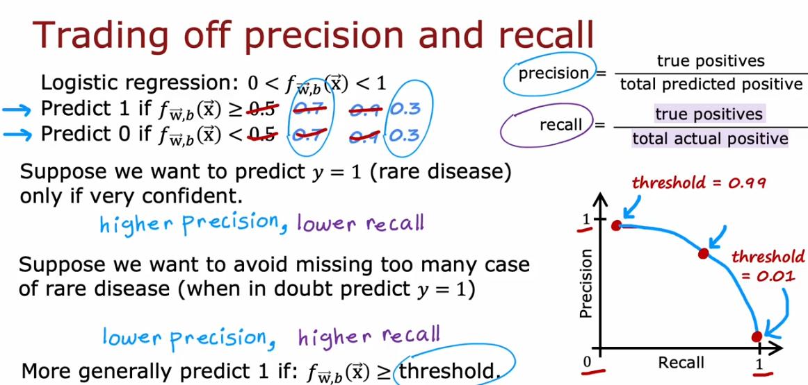
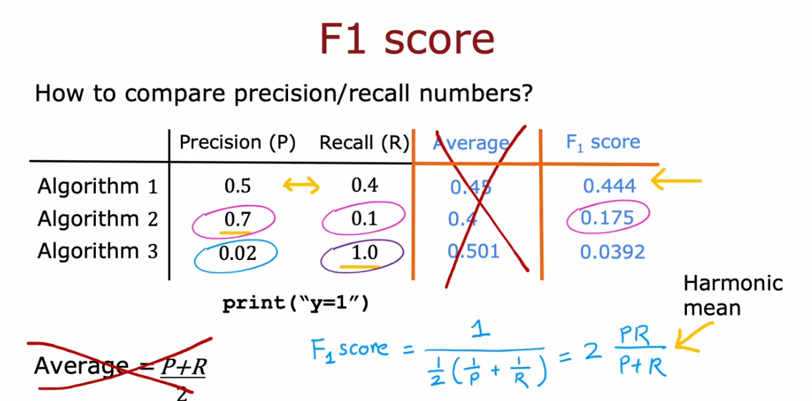