# Backpropagation

Backpropagation is an algorithm used to train artificial neural networks. It is a supervised learning algorithm that uses gradient descent to minimize the error between the predicted output and the actual output.

## Derivative

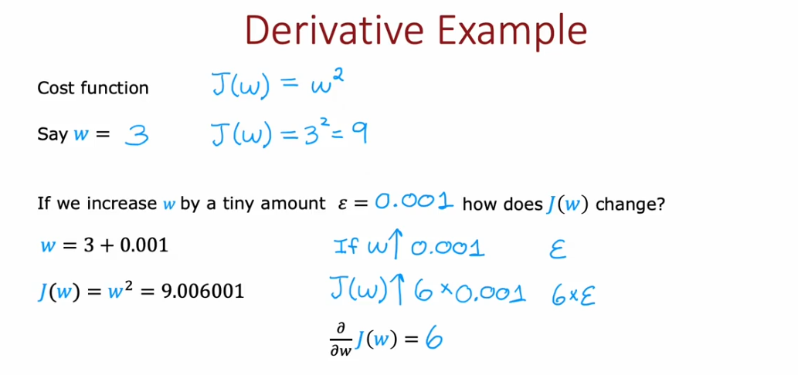
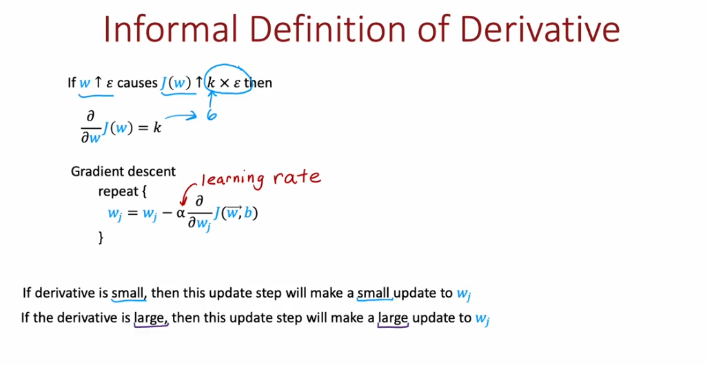
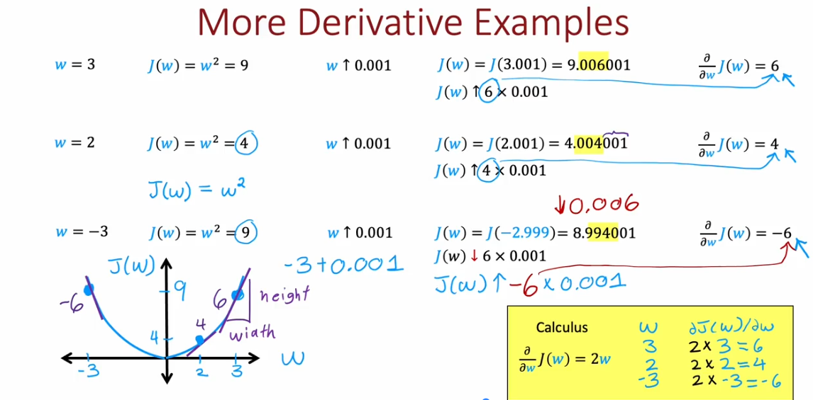
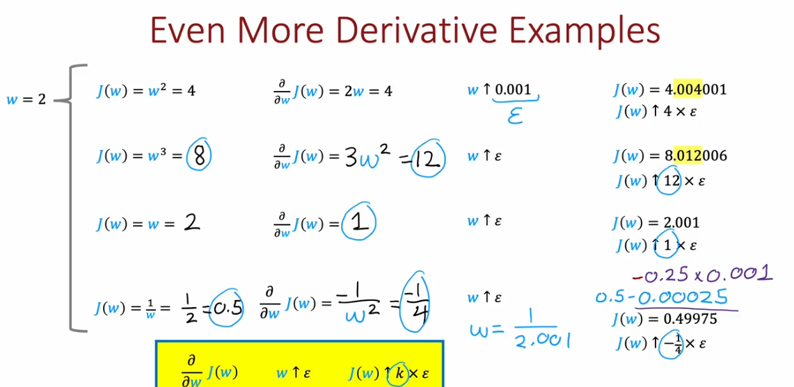
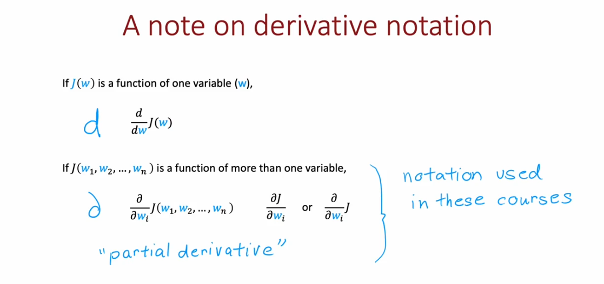

## Computational graph 

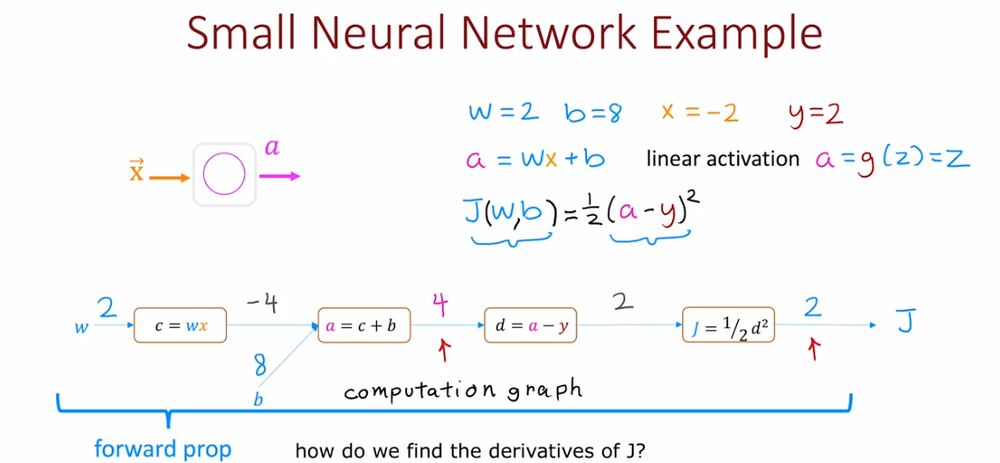
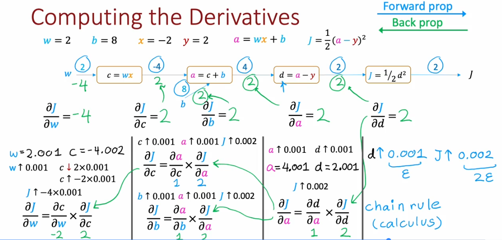
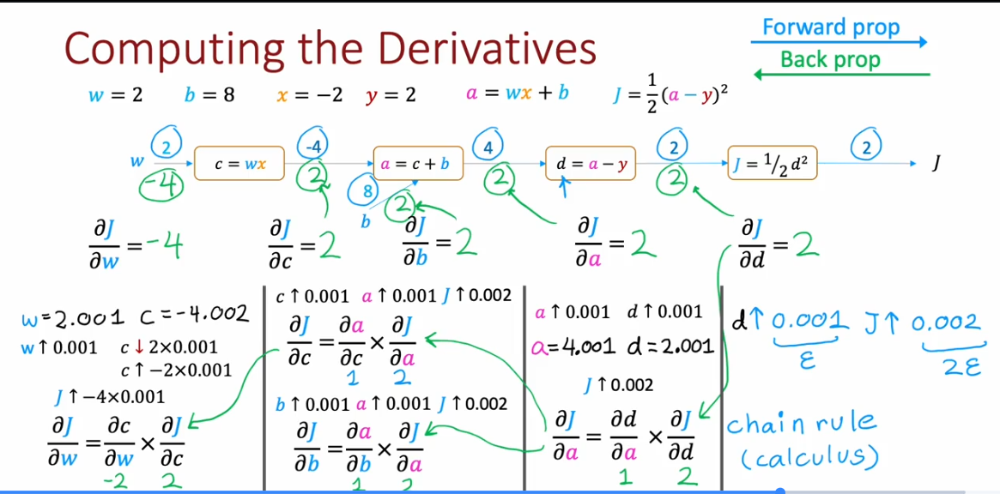
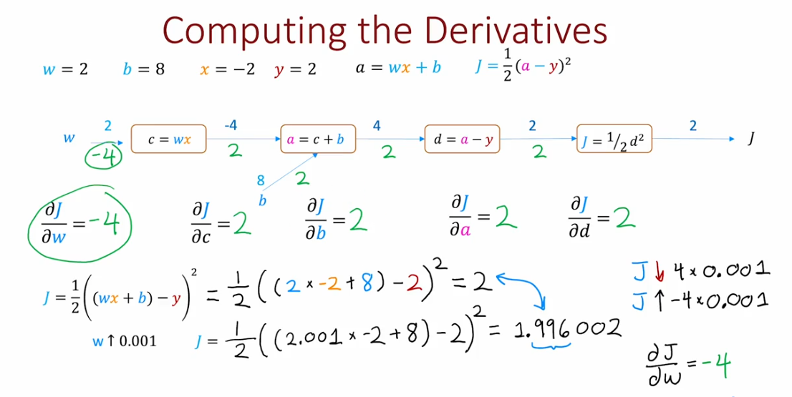
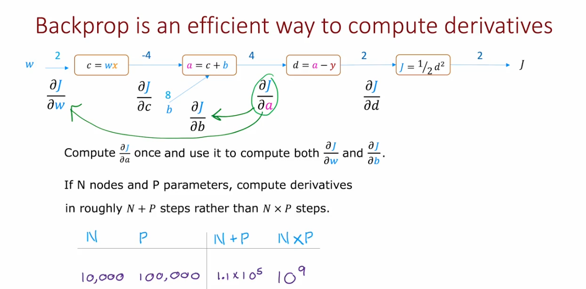

## Large Neurak Network

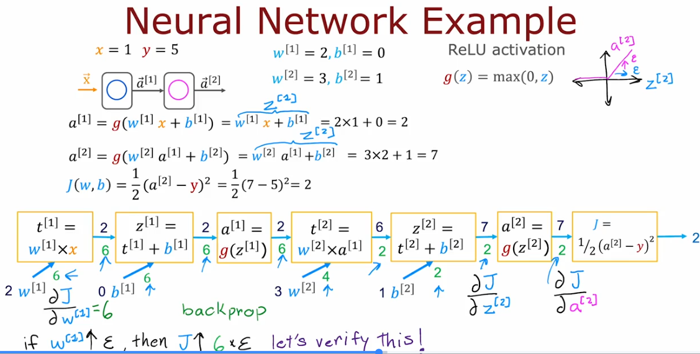
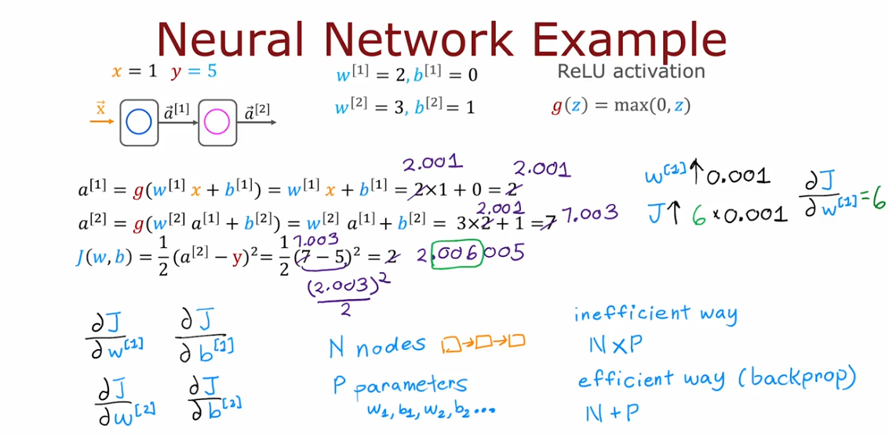