# Gradient Descent
- Gradient descent is an optimization algorithm used to minimize a cost function.
- It is used in machine learning to find the optimal parameters for a model.
- It is an iterative algorithm that starts with an initial guess for the parameters and updates them in the direction of the negative gradient of the cost function.
- The algorithm stops when the cost function is minimized or when a maximum number of iterations is reached.

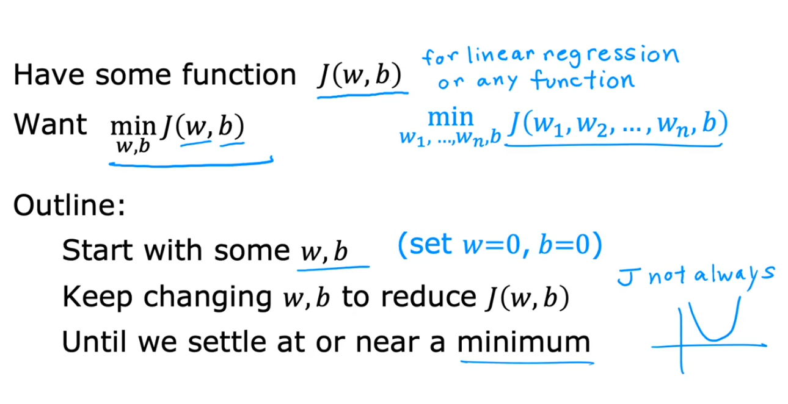
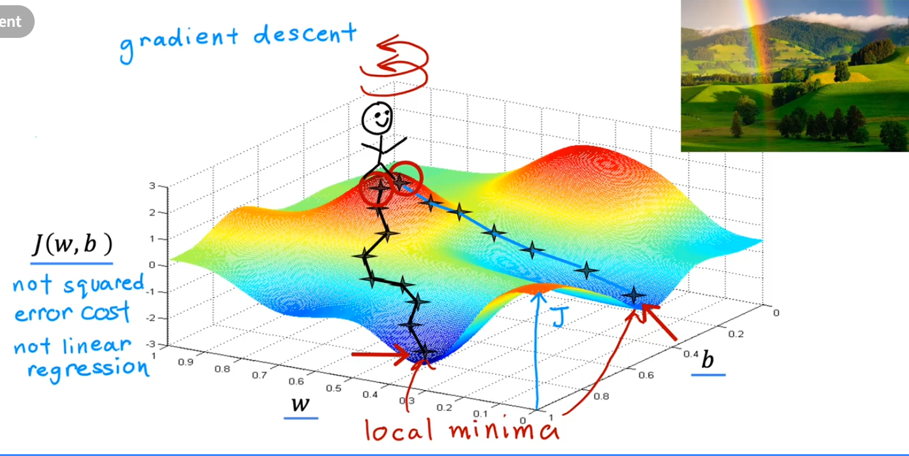
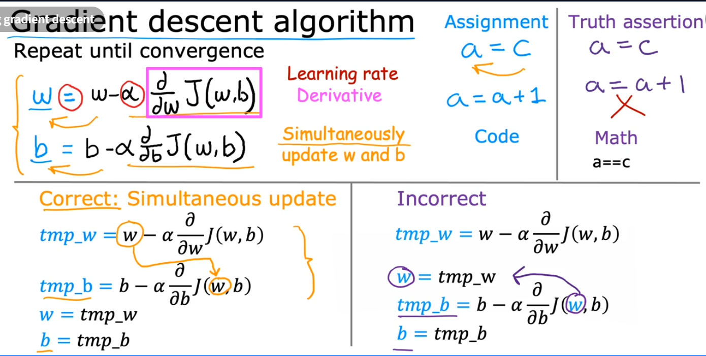
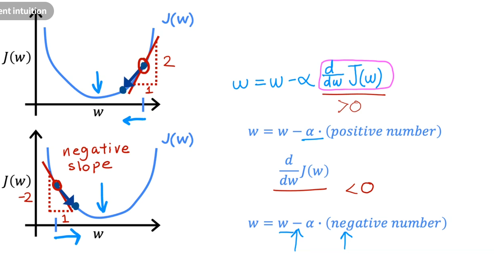

## Learning Rate
- Learning rate is a hyperparameter that determines the step size of the gradient descent algorithm.
- It is a value between 0 and 1.
- If the learning rate is too small, the algorithm will take too long to converge.
- If the learning rate is too large, the algorithm may overshoot the minimum and fail to converge.

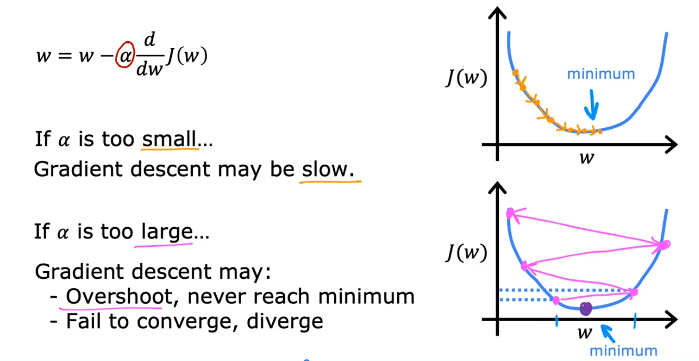
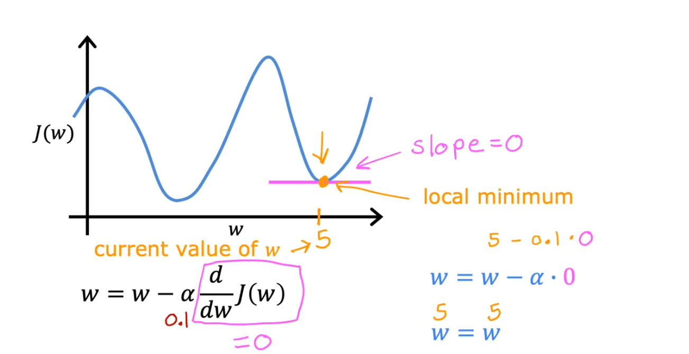
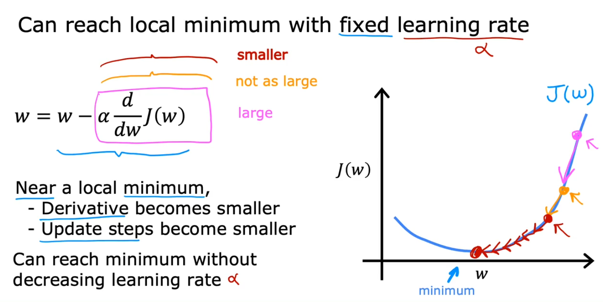

## Gradient Descent for Linear Regression
- Gradient descent for linear regression is used to find the optimal parameters for a linear regression model.
- It is an iterative algorithm that starts with an initial guess for the parameters and updates them in the direction of the negative gradient of the cost function.
- The algorithm stops when the cost function is minimized or when a maximum number of iterations is reached.

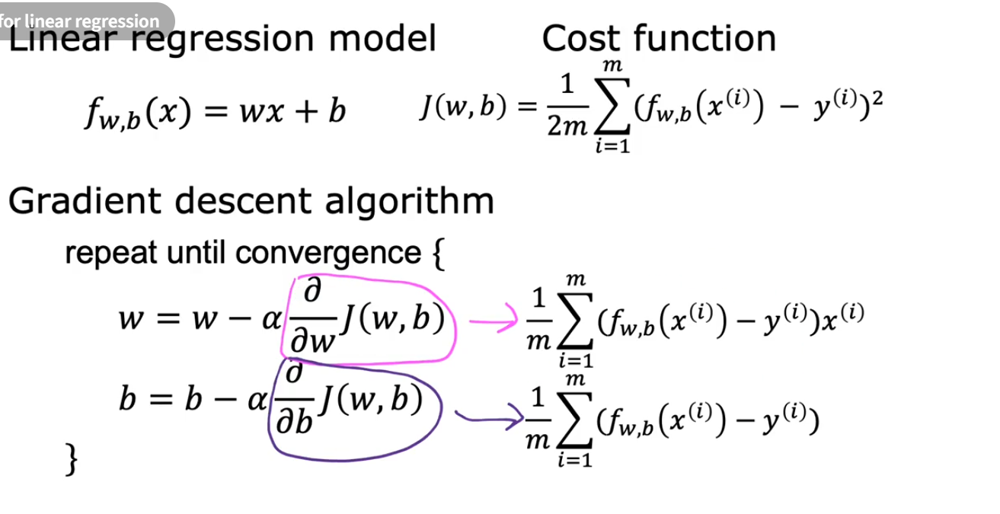
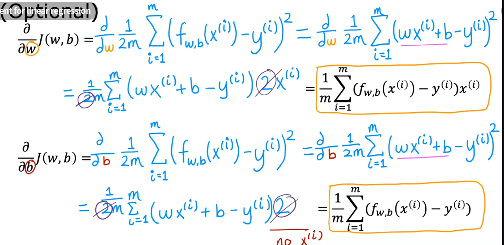
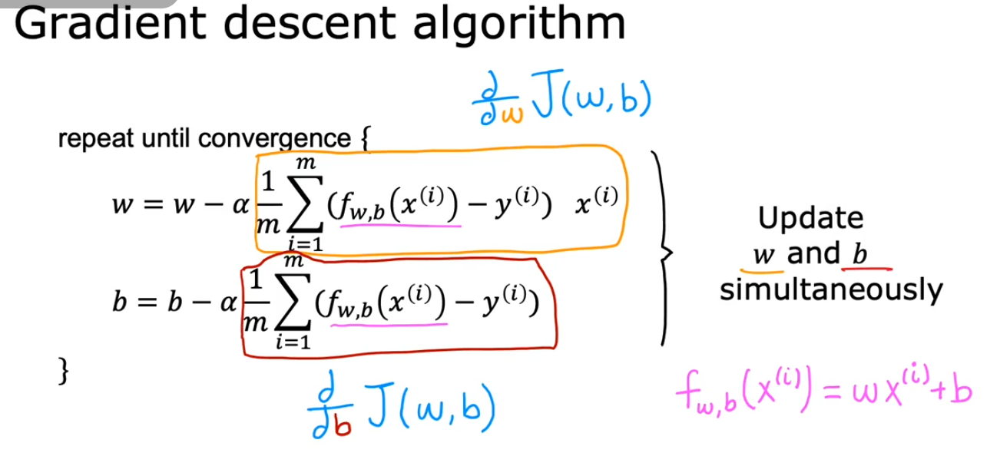
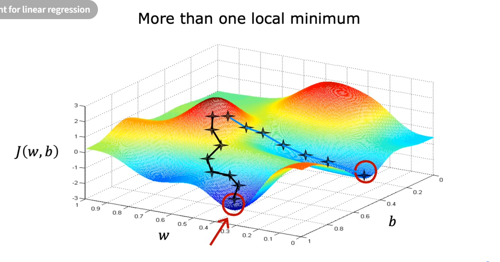
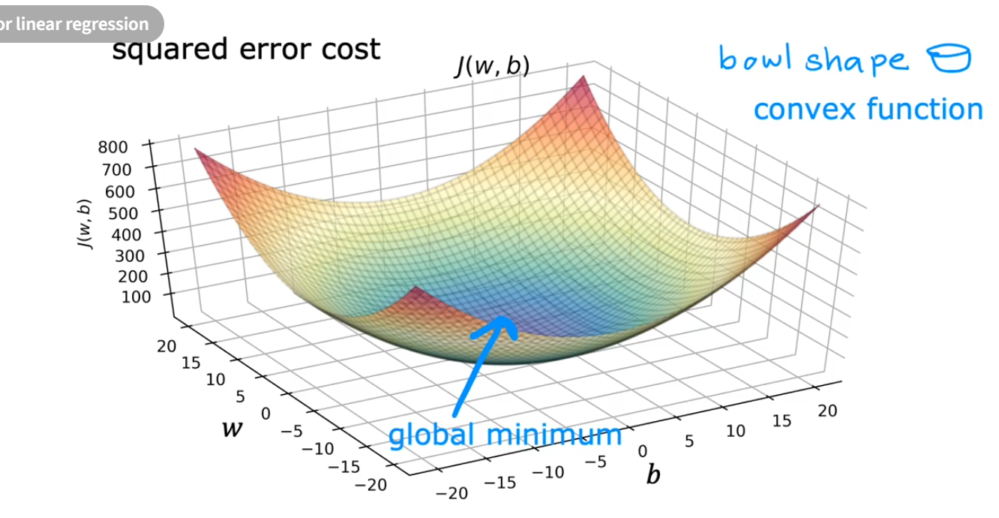
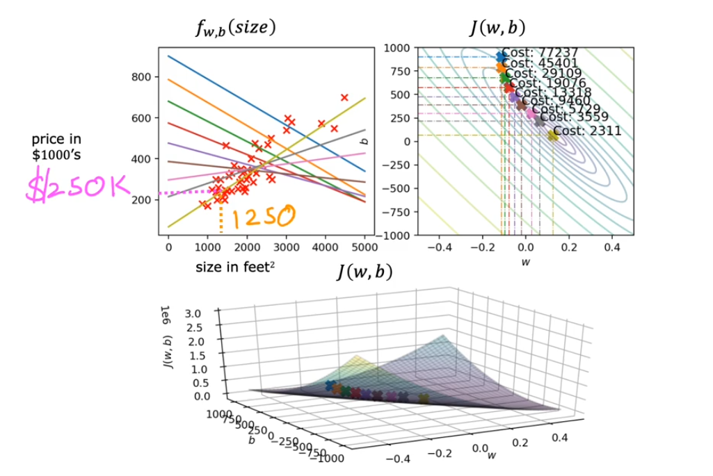
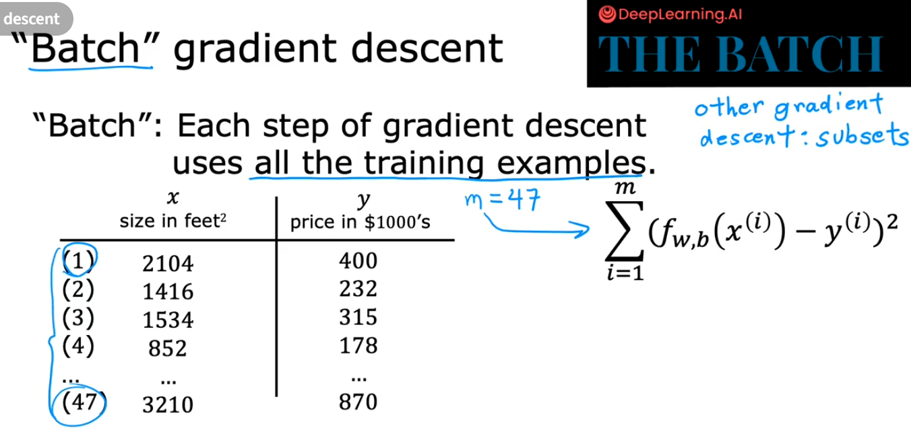