# Overfitting

Overfitting is a problem in machine learning where the model learns the training data too well and fails to generalize to new data.

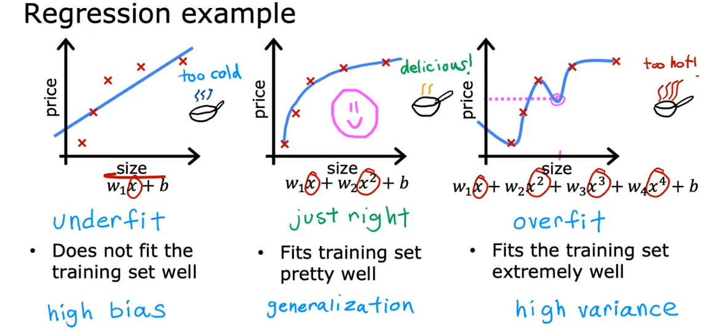
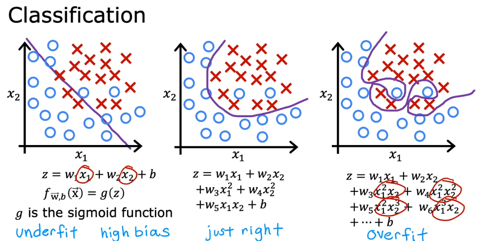

## Fixes for Overfitting

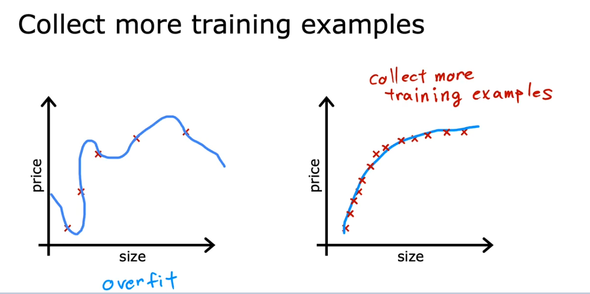
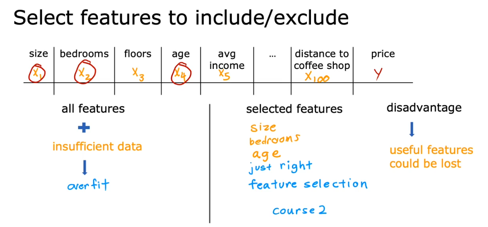
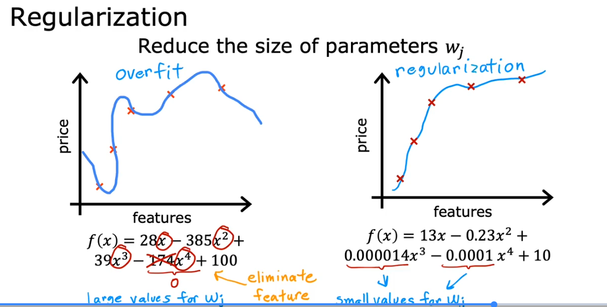
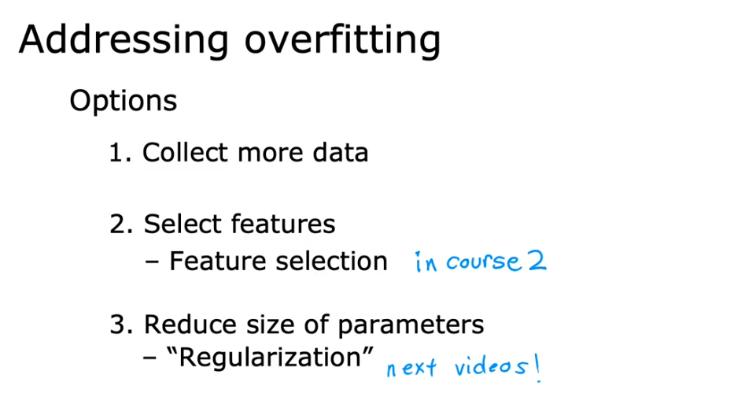

1. Add more data
2. Reduce the number of features
3. Use regularization
4. Use cross-validation
5. Use ensemble methods
6. Use dropout
7. Use early stopping
8. Use data augmentation
9. Use feature selection
10. Use feature engineering

## Regularization

Regularization is a technique used to prevent overfitting by adding a penalty term to the cost function. The penalty term is added to the cost function to discourage the model from learning the training data too well.

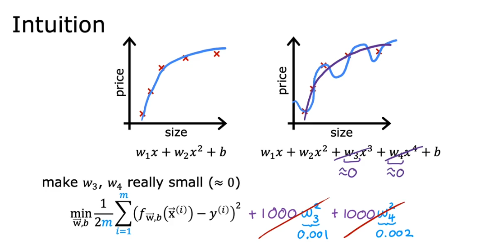
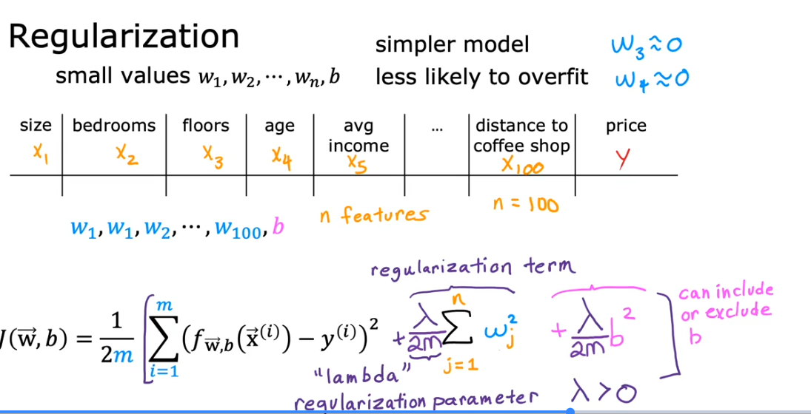
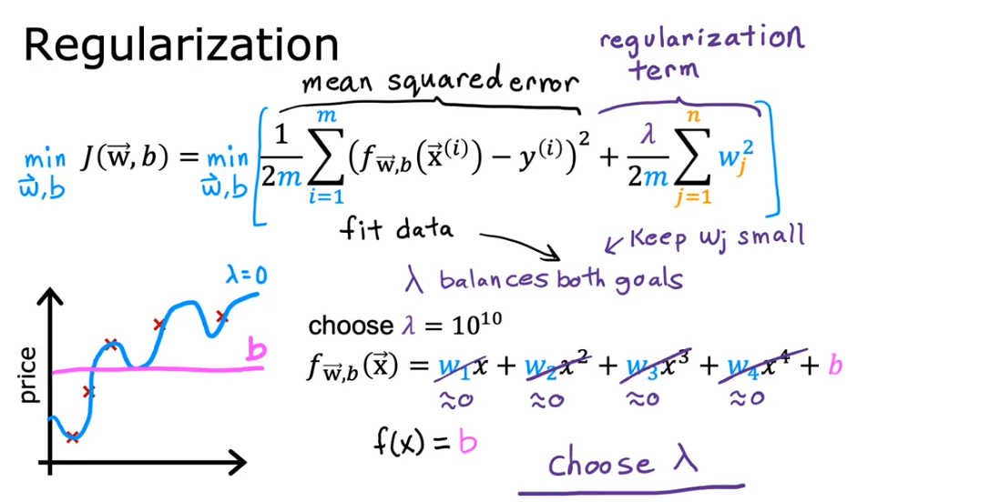

## Gradient Descent on Regularized Linear Regression

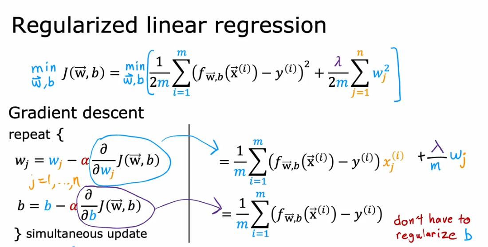
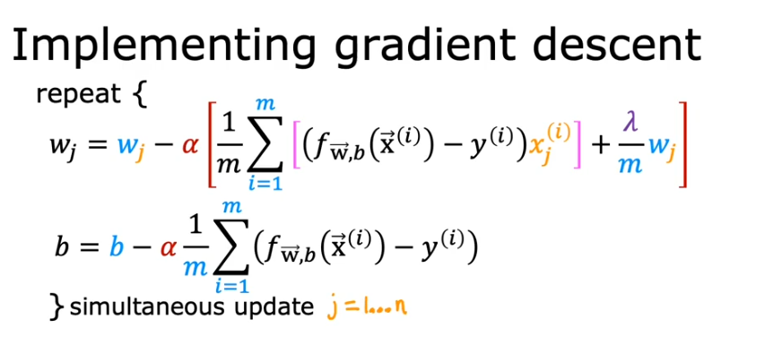
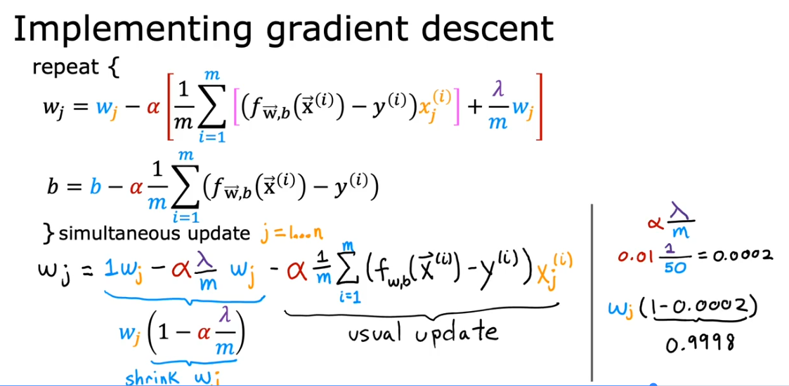
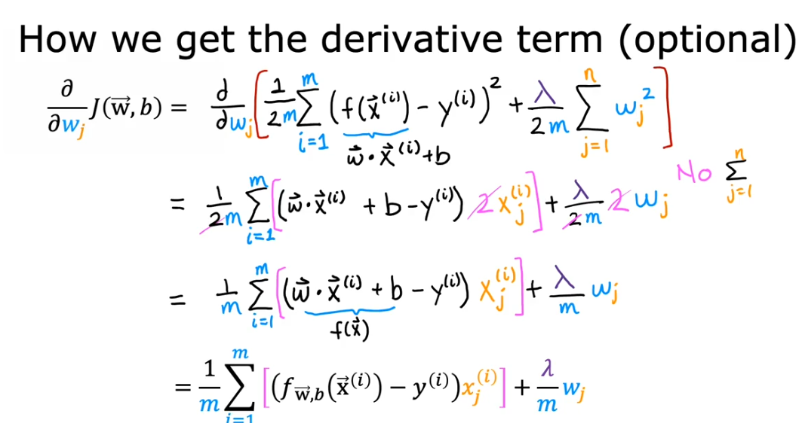

## Regularized Logistic Regression

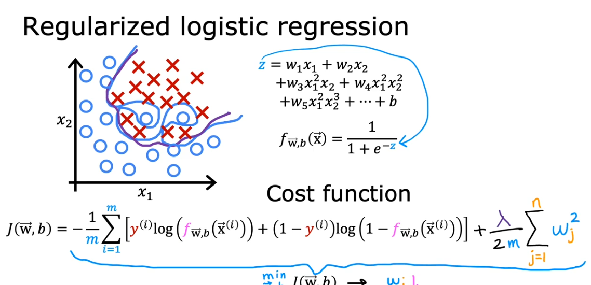
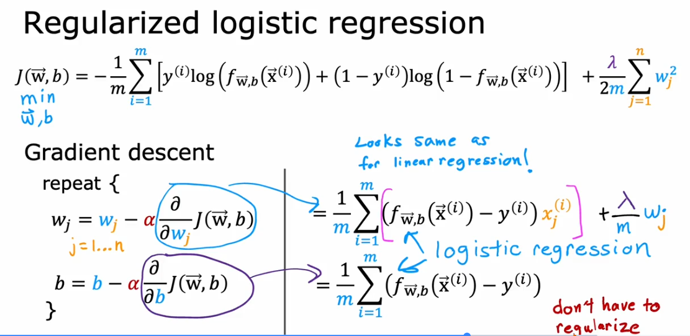