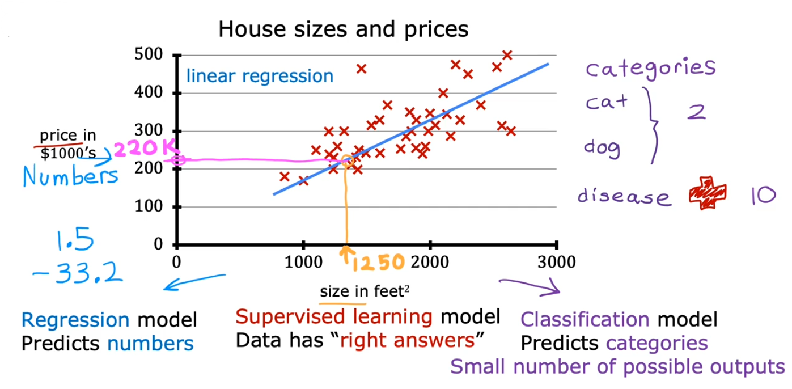
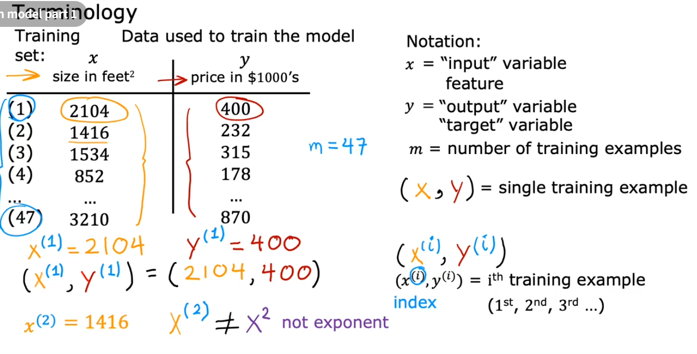
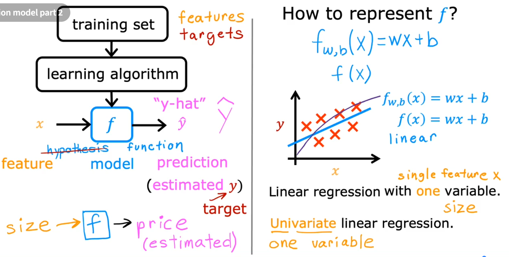
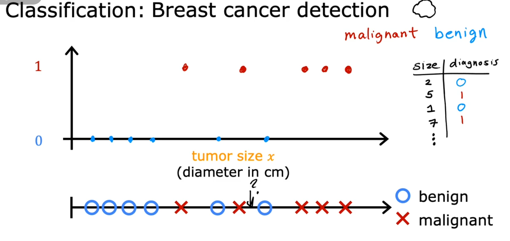
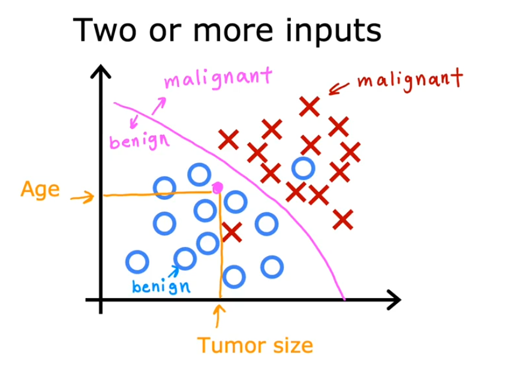
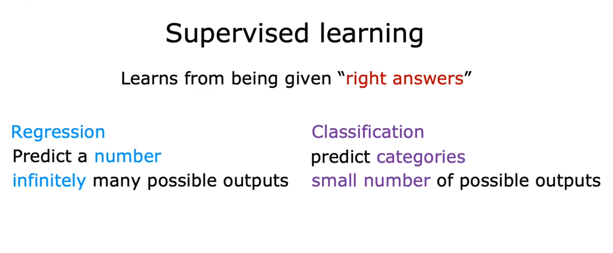
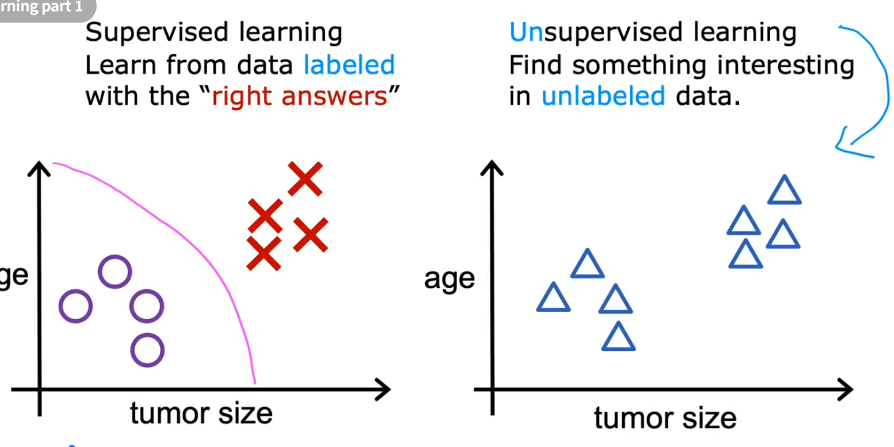
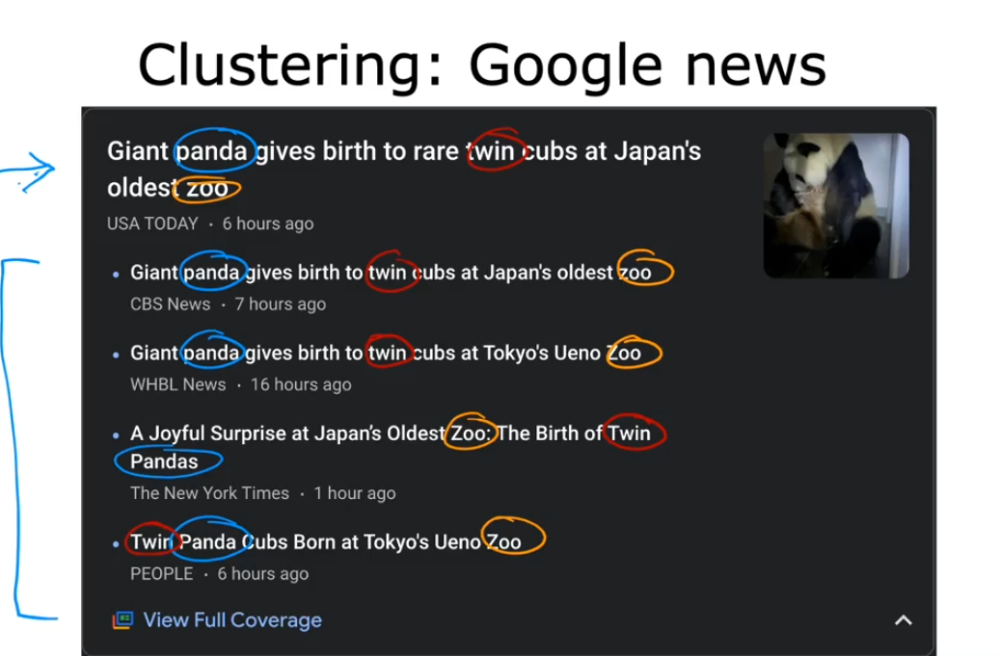
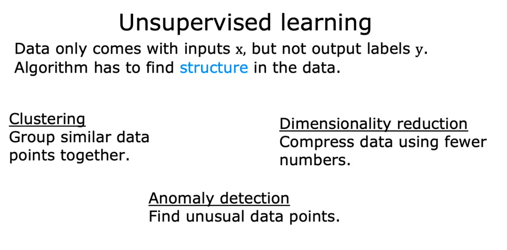

# Machine Learning

Field of study that gives computers the ability to learn without being explicitly programmed.

# Types of Machine Learning

- Supervised Learning
- Unsupervised Learning
- Recommender Systems
- Reinforcement Learning

## Supervised Learning

 
 
 
 
 
 
 

## Unsupervised Learning
Grouping or clustering unlabeled data points based on similarity.

